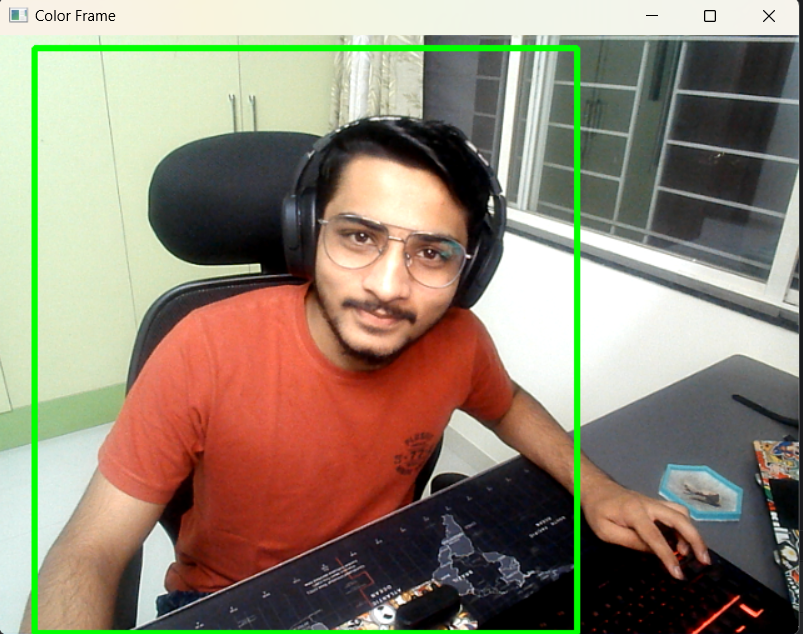

# FaceTrackerCV

**Description:** FaceTrackerCV is a Python script that tracks faces in real-time using OpenCV and logs face presence intervals to a CSV file. It records when faces enter and exit the frame, which can be useful for various applications such as monitoring user engagement or attendance tracking.

## Usage ⚙️

1. Install the required libraries:

   ```bash
   pip install opencv-python pandas

2. Clone this repository using:
    ```bash
    git clone https://github.com/your-username/FaceTrackerCV.git
    cd FaceTrackerCV

4. Run the python code in you IDE
   
5. Press 'q' to stop tracking and save the results to a CSV file named Object_Tracking.csv.

## Output ✌️
   1. Image Output:

   2. CSV File:
   
  ```bash
   ,Start,End
   0,2023-10-08 21:28:55.097856,2023-10-08 21:29:14.761809
   1,2023-10-08 21:29:15.036551,2023-10-08 21:29:15.194324
   2,2023-10-08 21:29:16.665851,2023-10-08 21:29:16.698236
   3,2023-10-08 21:29:16.794319,2023-10-08 21:29:16.889762
   4,2023-10-08 21:29:16.937966,2023-10-08 21:29:46.057411
   5,2023-10-08 21:29:46.603738,2023-10-08 21:29:46.729867
   6,2023-10-08 21:29:46.793608,2023-10-08 21:29:47.226282
   7,2023-10-08 21:29:48.135276,2023-10-08 21:29:48.665163
